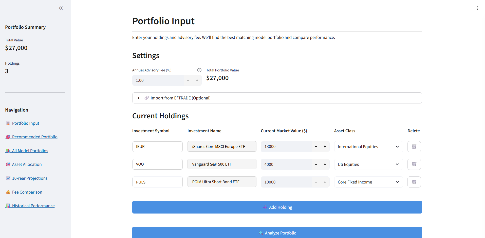
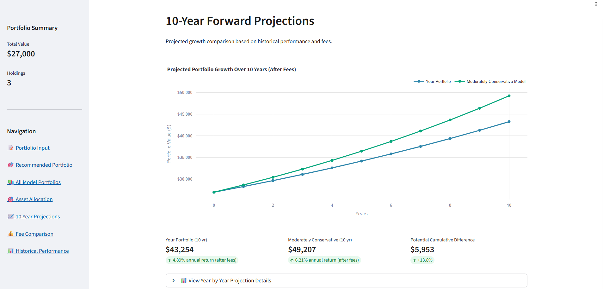
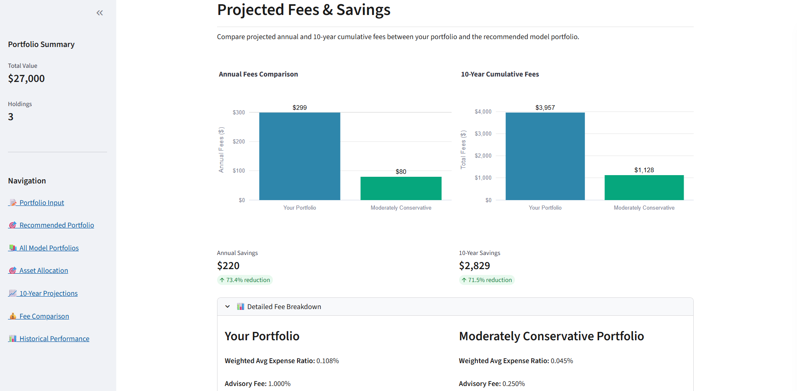
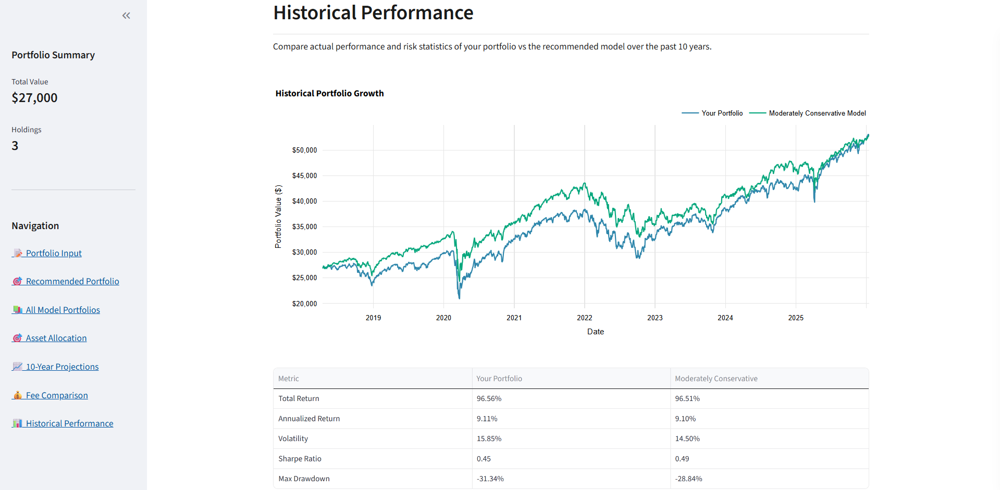
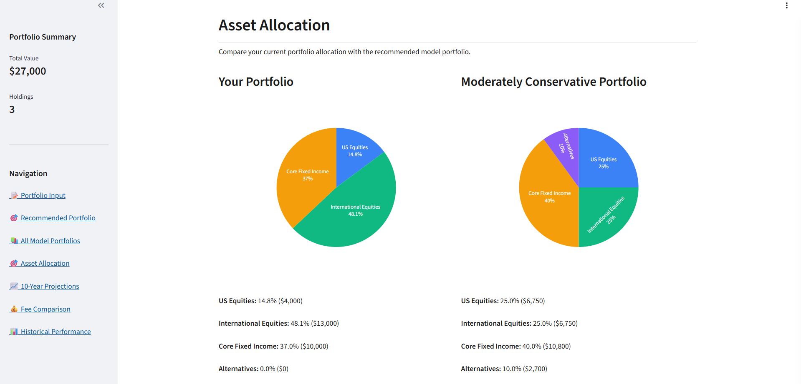

# Portfolio Analysis Web Application

## Overview



This application analyzes your current portfolio and suggests a cheaper alternative from 5 hypothetical model portfolios. For both your current portfolio and the model, users can see how they've performed historically, projects future growth, and a break down how much you're paying in fees.
This application provides:

- **10-Year Forward Projections**: Estimated future growth based on historical asset class returns
- **Fee Impact Analysis**: Compare how much you're paying in advisory fees and expense ratios
- **Historical Performance**: See actual portfolio performance from 2015-2025
- **Asset Allocation Comparison**: Visual breakdown of your holdings vs recommended portfolio
- **Smart Recommendations**: Automatic model matching based on your asset allocation

## Visualizations

### Forward Projections


### Fee Comparison


### Historical Performance


### Asset Allocation



## Features

### Interactive Portfolio Input
- Add investments by ticker symbol with real-time validation
- Automatic investment name lookup and classification
- Manual asset class override capability
- Dynamic portfolio value calculations
- Adjustable advisory fee settings

### Comprehensive Analysis Tools

**Forward Projections**
- 10-year growth estimates based on historical growth rates
- Asset class growth rates: US Equities 9%, International 8%, Bonds 3.5%, Alternatives 11%
- Compare current portfolio vs recommended model portfolio

**Fee Comparison**
- Annual fee breakdown (advisory fees + expense ratios)
- 10-year cumulative fee impact
- Potential savings calculations
- Side-by-side fee structure comparisons

**Historical Performance**
- Actual performance metrics from 2015-2025
- Total return, annualized return, and volatility
- Maximum drawdown analysis
- Sharpe ratio calculations
- Performance with and without advisory fees

**Asset Allocation**
- Interactive pie charts with consistent color coding
- Side-by-side current vs model portfolio comparison
- Detailed holdings breakdown with yields and expense ratios

### Model Portfolios

Five risk-based portfolios using low-cost ETFs:

- **Conservative**: 15% VOO, 20% VXUS, 60% BND, 5% VNQ
- **Moderately Conservative**: 25% VOO, 25% VXUS, 40% BND, 10% VNQ
- **Balanced**: 30% VOO, 25% VXUS, 30% BND, 15% VNQ
- **Moderately Aggressive**: 40% VOO, 20% VXUS, 15% BND, 25% VNQ
- **Aggressive**: 50% VOO, 15% VXUS, 0% BND, 35% VNQ

All model portfolios use a 0.25% advisory fee.

## Technology Stack

### Web Framework
- **Streamlit**: Interactive web application framework
- **Plotly**: Interactive charts and visualizations

### Data & Analytics
- **yfinance**: Yahoo Finance API for market data
- **pandas**: Time-series data manipulation
- **numpy**: Numerical computations and statistics

### Data Sources
- Yahoo Finance for historical prices and investment information
- No authentication required for public market data
- Real-time ticker validation and data retrieval

## Running the Application

The application runs on port 5000:

```bash
streamlit run app.py --server.port 5000 --server.address 0.0.0.0 --server.headless true
```

Or simply click the **Run** button in Replit.

## Application Structure

```
├── app.py                      # Main Streamlit web application
├── analytics/
│   ├── portfolio.py           # Core Portfolio class with analysis methods
│   ├── performance.py         # Returns, statistics, and projections
│   ├── data.py               # Data retrieval and ticker validation
│   ├── models.py             # Model portfolio definitions
│   ├── user_input.py         # Portfolio matching algorithms
│   └── reporting.py          # Visualization utilities
└── README.md                  # This file
```

## How to Use

### 1. Enter Your Portfolio
- Add ticker symbols for your investments (e.g., VOO, BND, AAPL)
- Enter the dollar value for each holding
- The app will automatically fetch current prices and classify investments

### 2. Set Your Advisory Fee
- Enter your current annual advisory fee percentage
- This will be used to calculate fee impact on returns

### 3. Review Asset Classification
- The app automatically classifies investments into asset classes
- You can manually override classifications if needed

### 4. Run Analysis
- Click "Analyze Portfolio" to generate comprehensive analysis
- View side-by-side comparisons with recommended model portfolio
- Explore historical performance, projections, and fee impacts

### 5. Interpret Results
- **Recommended Model**: Based on your current asset allocation
- **Fee Savings**: Potential annual and 10-year savings
- **Performance**: Historical returns and forward projections
- **Holdings Details**: Yields, expense ratios, and categorization

## Key Metrics Explained

**Total Return**: Overall percentage gain/loss over the period
**Annualized Return**: Average annual return (CAGR)
**Volatility**: Standard deviation of returns (risk measure)
**Sharpe Ratio**: Risk-adjusted return metric (higher is better)
**Max Drawdown**: Largest peak-to-trough decline

## Investment Classifications

- **US Equities**: Domestic stocks and stock funds
- **International Equities**: Non-US stocks and international funds
- **Core Fixed Income**: Bonds and bond funds
- **Alternatives**: Real estate, commodities, and alternative investments

## Disclaimers

This tool is for educational and informational purposes only. It is not investment advice. Past performance does not guarantee future results. Consult with a qualified financial advisor before making investment decisions.

## Privacy & Data

- No data is stored permanently
- All portfolio information is session-based
- Historical data fetched on-demand from public APIs
- No personal information is collected or transmitted

## Support

For issues or questions, refer to the Replit workspace or check the console logs for error messages.
